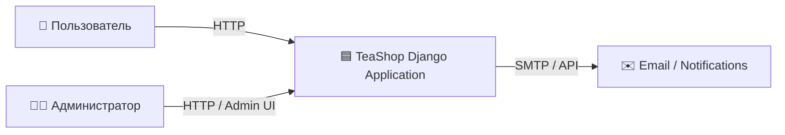
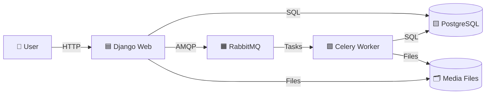

# Документация проекта: Интернет-магазин чая Tea-Shop
## Участники проекта
- Наместников К.А. - 5130904/30104
- Баско И.Л. - 5140904/30104
## Определение проблемы

Большинство существующих интернет-магазинов чая построены с использованием монолитной архитектуры, в которой все компоненты системы тесно связаны. Такой подход усложняет разработку, тестирование и масштабирование.

При добавлении новых функций или изменении существующей функциональности необходимо повторно развертывать все приложение, что увеличивает время разработки и риск возникновения ошибок.

Для решения этих проблем требуется модульная система с четко определенными обязанностями компонентов и четко определенными контрактами на API. Такой подход повышает масштабируемость, удобство обслуживания и гибкость интернет-магазина чая.

## Выработка требований

### Функциональные требования
1. **Управление каталогом товаров**
   - Система должна предоставлять каталог чайных продуктов с категориями
   - Для каждого товара должны храниться: название, цена, описание

2. **Система корзины покупок**
   - Пользователи должны иметь возможность добавлять товары в корзину, изменять количество, удалять товары
   - Корзина должна сохраняться между сессиями
   - Расчет общей стоимости заказа с учетом количества товаров

3. **Оформление и управление заказами**
   - Процесс оформления заказа с указанием данных заказа
   - После оформления заказа должен приходить email 

4. **Административная панель**
   - Управление товарами (добавление, редактирование, удаление)
   - Управление заказами (просмотр)

5. **Тестирование и развертывание**
   - Покрытие unit-тестами всех основных модулей
   - Docker-контейнеризация всех компонентов системы

### Пользовательские сценарии

**Сценарий 1: Покупка чая новым пользователем**
1. Пользователь заходит на сайт tea-shop
2. Просматривает каталог, используя фильтры по категориям
3. Выбирает "Matcha" и добавляет 2 шт в корзину
4. Добавляет "Da Hong Pao" - 1 шт в корзину
5. Переходит в корзину, видит общую сумму $18.47
6. Заполняет форму заказа: email, почтовый код, адрес
7. Подтверждает заказ, получает номер заказа
8. Получает email с подтверждением заказа

**Сценарий 2: Администратор добавляет новый товар**
1. Администратор входит в панель управления
2. Переходит в раздел "Товары" → "Добавить товар"
3. Заполняет данные: название "Bai Mu Dan", категория "White Tea", цена $4.49
4. Загружает изображение товара
5. Сохраняет товар, система автоматически добавляет его в каталог

### Оценка масштаба
- **Целевая аудитория**: 10,000 уникальных посетителей в месяц
- **Активные пользователи**: ~500 пользователей в сутки
- **Средний чек**: $12
- **Прогнозируемое количество заказов**: 100-150 заказов в день
- **Период хранения данных**: 5 лет (для аналитики и истории заказов)

## Расчет нагрузки

### Характер нагрузки
Система интернет-магазина имеет **высокое соотношение чтения к записи** - примерно **85% на 15%**.

### Read-операции (85% нагрузки)
- **Просмотр каталога товаров**: 75 запросов/час × 24 = 1,800 в день
- **Частота**: каждые 48 секунд от активных пользователей
- **Просмотр страницы товара**: 50 запросов/час × 24 = 1,200 в день
- **Проверка корзины**: 30 запросов/час × 24 = 720 в день

**Итого read-операций в день**: 1,800 + 1,200 + 720 + 480 = **3,720 операций**

### Write-операции (15% нагрузки)
- **Добавление в корзину**: 25 операций/час × 24 = 600 в день
- **Оформление заказа**: 10 операций/час × 24 = 240 в день (соответствует 150 заказам/день)
- **Изменение данных админом**: 5 операций/час × 24 = 120 в день

**Итого write-операций в день**: 600 + 240 + 120 = **960 операций**

### Итоговая нагрузка
- **Всего операций в день**: 3,720 + 960 = **4,680 операций**
- **Пиковая нагрузка** (дневное время 12:00-20:00): до 800 операций/час
- **Средний размер ответа API**: 5-10 КБ
- **Суточный трафик**: ~50-100 МБ
- **Объем данных за 5 лет**: ~50 ГБ (товары + заказы + пользователи)

### Показатели производительности
- **Время отклика API**: < 200 мс для 95% запросов
- **Доступность системы**: 99.5% (плановые работы - исключение)
- **Максимальное время простоя**: 4 часа в месяц

### Схемы проектирования

#### Контекстная диаграмма



#### Контейнерная диаграмма



### API Контракты

```http
Категории чаев
GET /api/v1/categories
Response 200
[
  {
    "id": 1,
    "name": "Green Tea",
    "slug": "green-tea"
  },
  {
    "id": 2,
    "name": "Black Tea",
    "slug": "black-tea"
  }
]

Получение всех чаев
GET /api/v1/products

Response 200

[
  {
    "id": 10,
    "name": "Sencha",
    "description": "Japanese green tea with a fresh herbal flavor",
    "category": {
      "id": 1,
      "name": "Green Tea"
    },
    "price": 6.50,
    "available": true
  }
]

Получение чая по ID
GET /api/v1/products/{id}/
Response 200

{
  "id": 10,
  "name": "Sencha",
  "description": "Japanese green tea with a fresh herbal flavor",
  "category": {
    "id": 1,
    "name": "Green Tea"
  },
  "price": 6.50,
  "available": true
}

Получение содержимого корзины
GET /api/v1/cart/
Response 200

{
  "items": [
    {
      "tea_id": 10,
      "name": "Sencha",
      "quantity": 2,
      "price": 6.50,
      "currency": "USD",
      "total_price": 13.00
    }
  ],
  "total_price": 13.00
}

Добавление чая в корзину
POST /api/v1/cart/add/

Request
{
  "tea_id": 10,
  "quantity": 1
}

Response 200
{
  "status": "ok"
}

Удаление чая из корзины
POST /api/v1/cart/remove

Request
{
  "product_id": 10
}
Response 200
{
  "status": "ok"
}

Создание заказа
POST /api/v1/orders/

Request
{
  "first_name": "John",
  "last_name": "Doe",
  "email": "john.doe@example.com",
  "address": "5 Tea Street",
  "postal_code": "10001",
  "city": "New York"
}

Response 201
{
  "order_id": 42,
  "status": "created"
}

Получение заказа по ID
GET /api/v1/orders/{id}/

Response 200
{
  "id": 42,
  "items": [
    {
      "tea": "Sencha",
      "quantity": 2,
      "price": 6.50
    }
  ],
  "total_price": 13.00,
  "created": "2025-01-06T14:20:00Z"
}
```